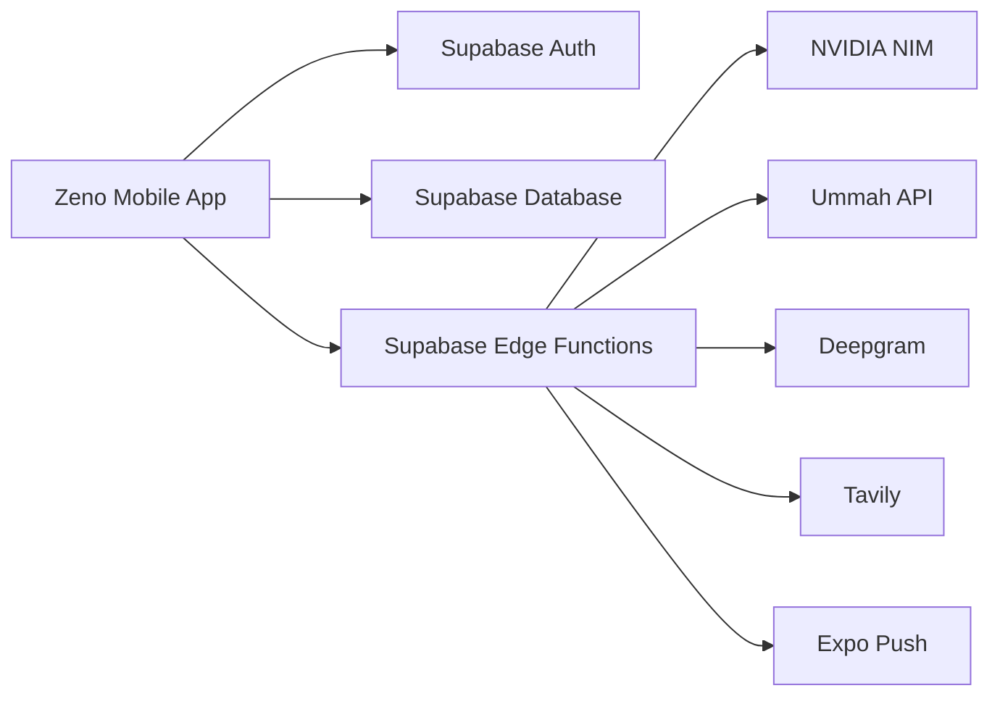
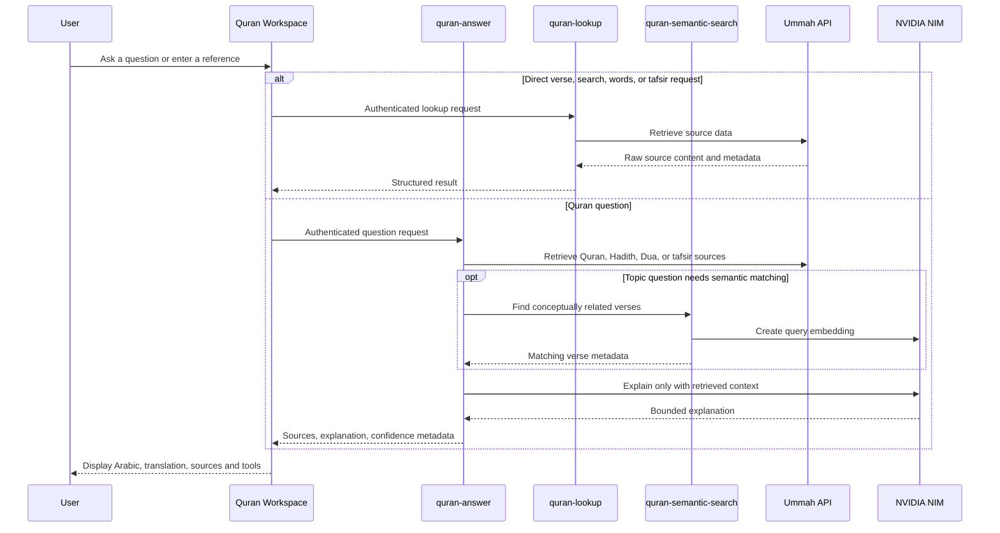

# Zeno Architecture

This document explains how Zeno is structured, with special focus on **Quran GPT**: how it retrieves religious content, how it separates source text from AI explanation, and how data moves through the system.

## System overview



Zeno is an Expo React Native application. The phone handles presentation, local interaction, and the authenticated user session. Supabase Edge Functions handle trusted server work and keep external-provider keys out of the mobile app.

| Layer | Responsibility |
| --- | --- |
| Expo / React Native client | Screens, navigation, chat UI, Quran presentation, audio controls, voice interface |
| Supabase Auth | User login and JWT sessions |
| Supabase Postgres + RLS | Chats, messages, Hifz progress, quiz scores, notification preferences, device tokens, Quran embeddings |
| Edge Functions | Authenticated secure API boundary for AI, Quran retrieval, voice, notifications, and persistence workflows |
| NVIDIA NIM | General chat models, Quran GPT explanations, semantic-search embeddings |
| UmmahAPI | Quran, translation, Hadith, Dua, tafsir, word data, and recitation audio retrieval |
| Deepgram | Streaming speech recognition and neural text-to-speech |
| Tavily | Optional current-web search for supported general-chat models |

## Client architecture

```text
app/
  _layout.tsx                 Application boot, theme, fonts, notification responses
  (auth)/sign-in.tsx          Sign-in
  (chat)/_layout.tsx          Authenticated Stack and native headers
  (chat)/index.tsx            Chat home, conversations, selected model, Voice Mode
  (chat)/quran.tsx            Quran & Learning hub and Quran GPT workspace
  (chat)/hifz.tsx             Memorisation practice
  (chat)/quiz.tsx             Quran Quiz
  (chat)/today.tsx            Daily Verse and Dua
  (chat)/settings.tsx         Appearance, notifications, guide, data controls

components/
  QuranAyahText.tsx           Safe Arabic ayah presentation
  QuranAudioPlayer.tsx        Recitation controls
  VoiceMode.tsx               Continuous speech conversation
  VoiceRecorder.tsx           One-shot speech-to-text
  ChatScreen / InputBar / MessageBubble / Sidebar / ModelPicker

lib/
  supabase.ts                 Authenticated Supabase client
  theme.tsx                   Light/dark design system
  models.ts                   Curated NVIDIA model catalog
  audio.ts                    Quran-recitation playback manager
  tts.ts                      Shared spoken-response playback manager
  notifications.ts            Push registration and preferences
```

The authenticated Stack owns page titles, safe-area spacing, native Android back behaviour, and transitions. Individual screens should focus on their feature content rather than recreating headers.

## Quran GPT architecture

### What Quran GPT is

Quran GPT is not a free-form model asked to reproduce Quran text from memory. It is a retrieval-first experience that combines:

1. direct Quran/Hadith/Dua/tafsir retrieval;
2. deterministic handling for known request types;
3. semantic matching for topic-style Quran questions;
4. a constrained AI explanation layer after sources are retrieved;
5. source-aware UI rendering and confidence/result states.

The Quran & Learning hub opens at `/quran` and provides these actions:

- **Ask Quran** — asks a Quran-related question.
- **Search Quran & Hadith** — looks up a verse or searches verified Quran/Hadith sources.
- **Continue Hifz** — opens memorisation practice.
- **Quran Quiz** — opens retrieval-based quizzes.
- **Today’s Verse & Dua** — opens the daily content screen.

Inside the research workspace, a compact switch changes between Quran and Hadith search. Hifz, Quiz, and Today stay as independent routes so Android Back and existing deep links remain natural.

### Quran GPT request flow



### Direct lookup and search

`quran-lookup` handles deterministic source requests:

| Request type | Example | Source behaviour |
| --- | --- | --- |
| Direct ayah | `2:255` | Retrieves the requested verse and metadata |
| Quran search | `patience` | Searches retrieved Quran translation/source data |
| Word-by-word | Verse + word tool | Retrieves word-level verse data |
| Tafsir | Verse + tafsir selection | Retrieves selected tafsir source |

This path does not need an LLM to decide Quran wording. Its purpose is accurate retrieval and clean result formatting.

### Quran questions and explanations

`quran-answer` handles questions that need more than a direct lookup. It:

1. validates the user JWT;
2. recognizes direct references and special request patterns when possible;
3. retrieves relevant Quran verses, Hadith, Dua, and tafsir material from configured sources;
4. calls `quran-semantic-search` for concept matching when keyword search is insufficient;
5. builds a context that clearly identifies retrieved material;
6. calls NVIDIA NIM for an explanation based on that retrieved context;
7. returns structured source data, generated explanation, and result metadata to the client.

The model is used as an explanation and synthesis layer. Retrieved sources remain the authoritative displayed religious content.

## Quran source integrity

### Raw Arabic is preserved

The client must not modify stored/retrieved Arabic Quran text. `QuranAyahText.tsx` is presentation-only.

When the source text lacks an end-of-ayah marker, the component renders a visual suffix using existing verified ayah metadata:

```text
Raw source:  وَرَأَيْتَ ٱلنَّاسَ يَدْخُلُونَ فِى دِينِ ٱللَّهِ أَفْوَاجًا
Rendered:    وَرَأَيْتَ ٱلنَّاسَ يَدْخُلُونَ فِى دِينِ ٱللَّهِ أَفْوَاجًا ۝٢
```

The suffix is only added when no existing marker is detected. The ayah number comes from metadata, uses Arabic-Indic digits, and does not alter the raw source string.

### Why this separation matters

| Concern | Design response |
| --- | --- |
| Model hallucination | Source verses/Hadith/Dua are retrieved rather than generated |
| Source formatting differences | Presentation helper adds only deterministic visual ayah marker when necessary |
| Topic search misses synonyms | Semantic search supplements literal search |
| Semantic match is not proof | The app still shows retrieved source metadata and should not present similarity as a ruling |
| Explanation needs context | Model receives retrieved source context rather than being asked to quote from memory |

## Semantic Quran search


`quran_embeddings` stores translation text and a 1024-dimensional vector for each indexed surah/ayah. `quran-semantic-search` embeds the user query with NVIDIA `nv-embedqa-e5-v5` and calls the Postgres `match_quran_verses` function, which uses cosine similarity.

Benefits:

- helps users discover verses about a topic even when their wording differs from the translation;
- keeps similarity matching in the project database after embedding;
- combines naturally with literal source retrieval.

Limits:

- similarity is approximate;
- it is not tafsir, a fatwa, or a scholarly ruling;
- quality depends on the embedding model and the indexed translation set.

## Other Quran-learning flows

| Feature | Client | Edge Function | Data/result |
| --- | --- | --- | --- |
| Hifz | `hifz.tsx` | `memorization-progress` | Per-user ayah status, review due list, statistics |
| Quran Quiz | `quiz.tsx` | `quran-quiz` | Retrieved-verse questions and saved scores |
| Daily content | `today.tsx` | `send-daily-notification` | Deterministic daily Verse/Dua and push payloads |
| Recitation | `QuranAudioPlayer.tsx` | `quran-audio` | Retrieved audio URL and playback state |
| Reflection | Quran result tools | `tadabbur` | Retrieved verse/tafsir plus constrained reflection |

Hifz and Quiz use real retrieved verse material rather than generated Quran wording. Hifz progress and Quiz results are stored per authenticated user.

## Database and privacy model

| Table | Purpose | Access model |
| --- | --- | --- |
| `chats` / `messages` | Conversation history and model/source metadata | Belongs to the signed-in user’s chats |
| `memorization_progress` | Hifz state per surah/ayah | User-owned Row Level Security |
| `quiz_results` | Quiz score history | User-owned Row Level Security |
| `push_tokens` | Expo device token | User-owned Row Level Security |
| `notification_preferences` | Daily preferences and time | User-owned Row Level Security |
| `quran_embeddings` | Shared semantic-search index | Shared content database |

Edge Functions use server-side service credentials only after authenticating the request token. Any new user-owned table must add both a database migration and Row Level Security policies.

## Voice and general chat

General chat uses selected NVIDIA NIM models. Optional web search is available through Tavily for supported tool-capable model flows.

Voice Mode streams 16 kHz mono PCM audio through the authenticated `speech-token` WebSocket proxy to Deepgram. Interim/final speech events are merged for live captions. The final transcript is sent to the normal `chat` function with the active selected model. Deepgram TTS generates speech audio; `lib/tts.ts` serializes chunks with playback ownership/session guards so stale or competing playback does not interrupt the active voice response.

## Security and operational rules

1. Never place NVIDIA, UmmahAPI, Deepgram, Tavily, or Supabase service-role secrets in the Expo app.
2. Never use an LLM to invent Quran Arabic, Hadith, or Dua text.
3. Preserve retrieved Arabic; use `QuranAyahText` for presentation changes only.
4. Validate JWTs inside Edge Functions that use server privileges.
5. Keep user data protected through Row Level Security.
6. Treat voice/audio and notifications as real-device-tested features.
7. Keep diagnostics privacy-safe: state, timing, counts, and error codes—not tokens, audio, full transcripts, or full model responses.

## Where changes belong

| Change | Primary file | Also inspect |
| --- | --- | --- |
| Navigation or native headers | `app/(chat)/_layout.tsx` | `Sidebar.tsx` and Android Back behaviour |
| General chat sending | `app/(chat)/index.tsx` | `supabase/functions/chat/index.ts` |
| Quran workspace or result UI | `app/(chat)/quran.tsx` | Relevant Quran Edge Function |
| Quran Arabic presentation | `components/QuranAyahText.tsx` | Every Quran display consumer |
| Hifz state | `app/(chat)/hifz.tsx` | `memorization-progress` and its migration |
| Quiz behaviour | `app/(chat)/quiz.tsx` | `quran-quiz` |
| Daily notifications | `app/(chat)/settings.tsx` | `lib/notifications.ts` and `send-daily-notification` |
| Live captions | `components/VoiceMode.tsx` | `speech-token` WebSocket proxy |
| Spoken response playback | `lib/tts.ts` | `tts`, `VoiceMode`, and `MessageBubble` |
| Quran recitation playback | `components/QuranAudioPlayer.tsx` | `lib/audio.ts` and `quran-audio` |

## Further documentation

- [Project README](README.md)
- [In-project implementation guide](zeno-app/ARCHITECTURE.md)
