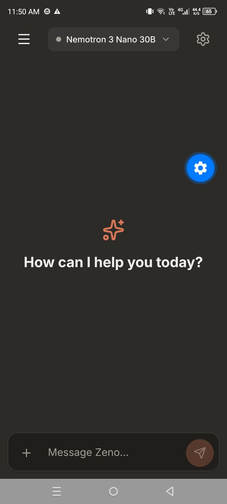
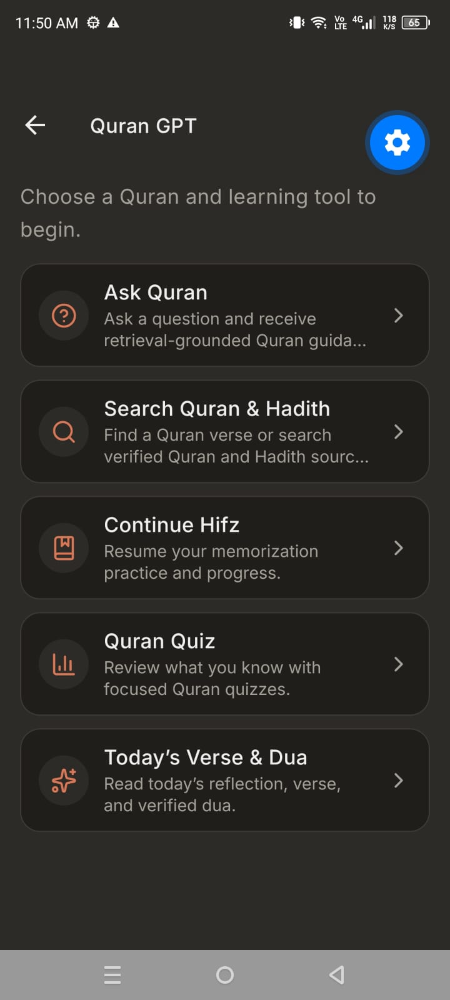
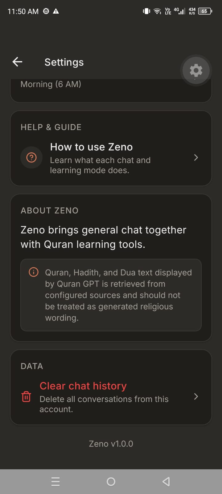
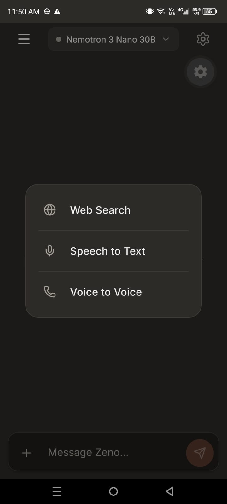
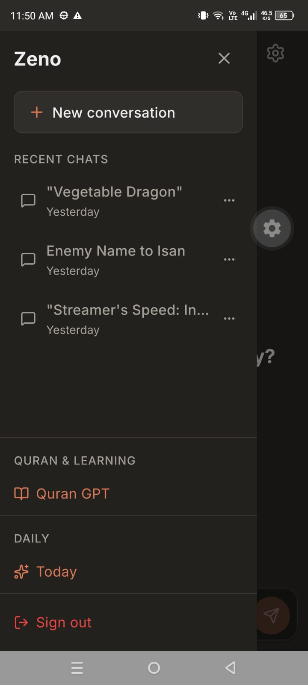
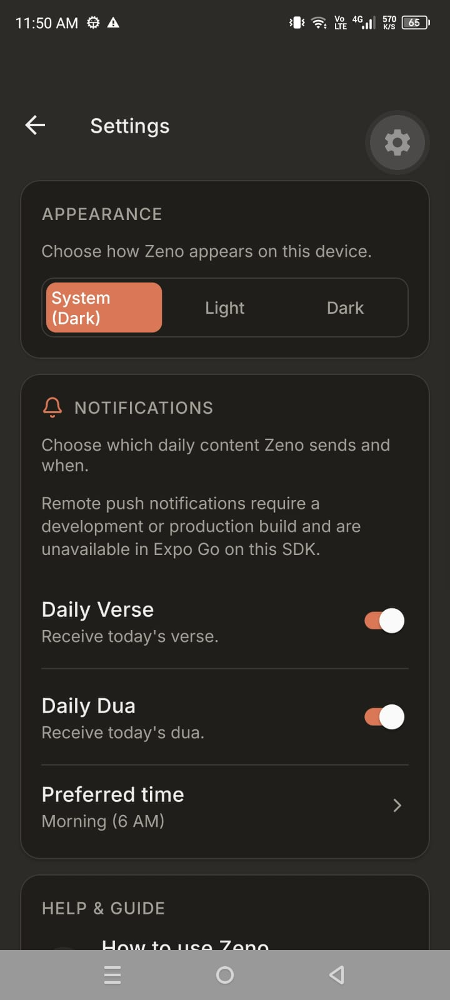
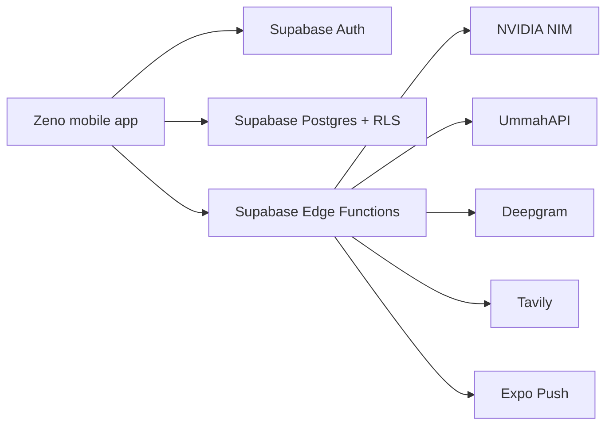

# Zeno AI

> A thoughtful AI chat companion with Quran learning tools, verified Islamic-content retrieval, Hifz practice, quizzes, daily reflections, and voice interaction.

<p align="center">
  
  
  
</p>

<p align="center">
  <a href="#features">Features</a> •
  <a href="#technology">Technology</a> •
  <a href="#getting-started">Getting started</a> •
  <a href="#project-structure">Project structure</a> •
  <a href="#religious-content-principles">Content principles</a>
</p>

## Why Zeno?

Zeno brings everyday AI chat and focused Quran learning into one calm, mobile-first experience. It is built around an important distinction: AI can help explain and navigate material, while Quran, Hadith, Dua, tafsir, and recitation content are retrieved from configured sources rather than invented by a model.

## Features

### AI chat

- Multi-model AI chat powered by the NVIDIA NIM catalog.
- Recent conversations with rename, delete, and history controls.
- Optional web-search flow for supported models, with source metadata.
- Text-to-speech for assistant messages.
- Speech-to-text and continuous Voice-to-Voice conversation.

### Quran & Learning

- **Ask Quran** — source-grounded Quran questions and explanations.
- **Search Quran & Hadith** — direct ayah lookup, search, and Hadith discovery.
- **Quran display care** — deterministic ayah-end markers using verified ayah metadata; raw Arabic remains unchanged.
- **Tafsir and word-by-word support** where available from the retrieval source.
- **Quran audio** with recitation playback.
- **Hifz** — read along, progressive hide, recall practice, saved progress, and review scheduling.
- **Quran Quiz** — retrieval-based quiz questions and saved results.
- **Today** — a daily Verse and Dua experience.

### Personalization and app experience

- Warm-neutral light and dark themes.
- Native mobile navigation and Android back behaviour.
- Daily Verse/Dua notification preferences and preferred time.
- In-app Help & Guide explaining every mode.

## Screenshots

<p align="center">
  
  
  
  
</p>

> Some development screenshots include Expo Go's floating development control. It is not part of the Zeno interface.

## Technology

| Layer | Technology | Role |
| --- | --- | --- |
| Mobile app | Expo SDK 57, React Native, React 19, TypeScript | Cross-platform Android/iOS/web experience |
| Routing | Expo Router | File-based routes, native Stack headers, deep links |
| Authentication & data | Supabase Auth, Postgres, Row Level Security | Sessions, chats, messages, learning progress, preferences |
| Server layer | Supabase Edge Functions (Deno) | Secure provider integration and trusted business logic |
| AI models | NVIDIA NIM | Configurable chat models and semantic embeddings |
| Religious-content retrieval | UmmahAPI | Quran, Hadith, Dua, tafsir, word data, and audio retrieval |
| Voice | Deepgram | Streaming speech recognition and neural text-to-speech |
| Web search | Tavily | Optional current-web results for supported chat flows |
| Semantic search | pgvector | Quran translation similarity search |
| Notifications | Expo Notifications + Expo Push | Daily Verse and Dua delivery |

## Architecture



The application keeps third-party API keys on the server. The device authenticates with Supabase, and Edge Functions validate the user before calling external providers.

## Religious-content principles

Zeno is designed to treat religious source material responsibly:

1. Quran Arabic, translations, Hadith, Dua, tafsir, and Quran audio are retrieved from configured providers.
2. The app does not use an LLM to generate Quran Arabic or substitute it for a retrieved verse.
3. The raw retrieved Arabic is preserved exactly.
4. The Quran display helper only adds a visual ayah-end marker when the source lacks one, using existing verified ayah metadata. It avoids duplicate markers.
5. Semantic search helps find relevant verses, but it is not a substitute for verified sources or scholarly interpretation.

## Getting started

### Prerequisites

- Node.js compatible with Expo SDK 57
- npm
- Expo Go or an Android/iOS development build
- A Supabase project
- Provider credentials for the features you intend to run

### Install

The Expo application is located in the `zeno-app` directory.

```powershell
git clone https://github.com/nofilkhan1/Zeno-AI.git
cd Zeno-AI\zeno-app
npm install
```

### Configure environment variables

Create `zeno-app/.env` with client-safe values:

```env
EXPO_PUBLIC_SUPABASE_URL=your_supabase_project_url
EXPO_PUBLIC_SUPABASE_ANON_KEY=your_supabase_anon_key
EXPO_PUBLIC_EXPO_PROJECT_ID=your_expo_project_id
```

Configure server-only secrets in your Supabase Edge Function environment, not in the Expo app:

```text
SUPABASE_URL
SUPABASE_SERVICE_ROLE_KEY
NVIDIA_NIM_API_KEY
UMMAH_API_KEY
DEEPGRAM_API_KEY
TAVILY_API_KEY
```

Never commit secrets. Values prefixed with `EXPO_PUBLIC_` are bundled into the mobile app and must not contain private credentials.

### Run the app

```powershell
npm start
```

Useful commands:

```powershell
npm run android
npm run ios
npm run web
.\node_modules\.bin\tsc.cmd --noEmit
```

## Supabase setup

The repository includes database migrations and Edge Function source. Apply migrations and deploy functions to a Supabase project before expecting authenticated data, progress, notifications, voice, or provider-backed learning features to work.

Important stored data includes:

- chats and messages;
- memorization progress;
- quiz results;
- push tokens and notification preferences;
- Quran translation embeddings for semantic search.

User-owned tables use Row Level Security so users can only access their own data. Edge Functions validate user JWTs before operating with server credentials.

## Project structure

```text
.
├── zeno-app/
│   ├── app/                    # Expo Router routes and layouts
│   ├── components/             # Chat, sidebar, Quran, audio and voice UI
│   ├── lib/                    # Theme, Supabase client, models, audio, TTS, notifications
│   ├── supabase/functions/     # Deno Edge Functions
│   ├── supabase/migrations/    # Database schema and RLS migrations
│   ├── scripts/                # Quran import and embedding helpers
│   └── package.json
├── docs/screenshots/           # README screenshots
└── ZENO_COMPLETE_TECHNICAL_REFERENCE.md
```

## Key server functions

| Function | Purpose |
| --- | --- |
| `chat` | Authenticated general chat, model selection, chat persistence, optional web-search flow |
| `quran-answer` | Retrieval-backed Quran questions and constrained explanations |
| `quran-lookup` | Direct ayah lookup, Quran search, words, and tafsir lookup |
| `hadith-search` | Verified Hadith search |
| `quran-semantic-search` | Quran topic matching using embeddings and pgvector |
| `quran-quiz` | Retrieval-based quiz generation and score persistence |
| `memorization-progress` | Hifz progress, review queue, and statistics |
| `quran-audio` | Quran recitation audio retrieval |
| `speech-token` | Authenticated WebSocket proxy for streaming Deepgram STT |
| `tts` | Authenticated Deepgram text-to-speech audio generation |
| `send-daily-notification` | Daily Verse/Dua push delivery |

## Voice notes

Voice-to-Voice uses a guarded streaming pipeline:

1. the app streams 16 kHz mono PCM microphone buffers;
2. a Supabase WebSocket proxy validates the user and forwards data to Deepgram;
3. interim and final transcript events power live captions;
4. overlapping transcript segments are merged before submission;
5. the normal chat function answers with the active selected model;
6. Deepgram generates spoken audio;
7. the TTS manager serializes chunks and protects against stale playback sessions.

Speech accuracy and voice quality still depend on the selected model, device microphone, room noise, speaker echo, network conditions, and third-party provider behaviour.

## Verification checklist

Before a release, verify:

- TypeScript passes: `./node_modules/.bin/tsc.cmd --noEmit`
- `git diff --check` passes
- authentication restore/sign-out and chat persistence
- normal chat and web-search results
- Quran lookup such as `2:255`, Quran questions, Hadith search, tafsir, word data, audio, and ayah markers
- Hifz progress, quiz results, Today content, and notification preference persistence
- live voice captions, Voice-to-Voice response playback, End Call, and normal message TTS
- Android Back and deep links for authenticated routes

## Documentation

- [Complete technical reference](ZENO_COMPLETE_TECHNICAL_REFERENCE.md)
- [In-app architecture guide](zeno-app/ARCHITECTURE.md)

## License

See [LICENSE](zeno-app/LICENSE).

