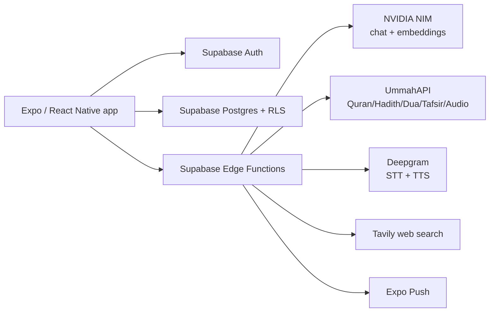
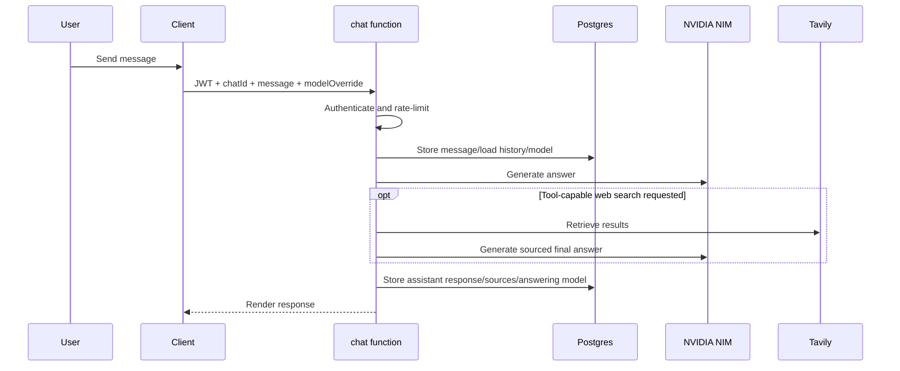
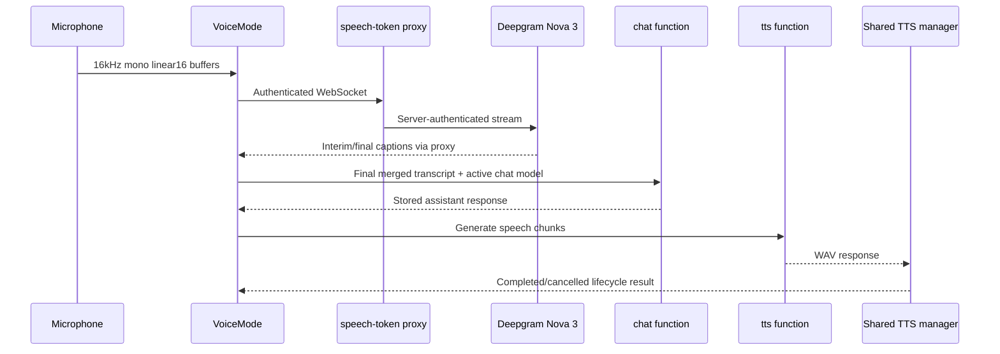

# Zeno — Complete Technical Reference

Source code lives in `C:\chat app\zeno-app`. This is an independent, detailed description of the implemented system.

## Product purpose

Zeno is an authenticated mobile application for general AI chat and Islamic learning. It provides normal chat, optional web search, Quran and Hadith research, Hifz memorisation, Quran quizzes, a daily Verse and Dua, notifications, Quran recitation audio, text-to-speech, and Voice-to-Voice conversation.

The system has one central safety rule: Quran Arabic, translations, Hadith, Dua, tafsir, word-by-word content, and Quran audio are retrieved from external religious-content services. An LLM may explain retrieved content, but must not manufacture, silently amend, or replace source text.

## Architecture overview



The mobile app uses only public Supabase configuration and the user’s session token. Provider keys and the Supabase service-role key remain in the Edge Function environment. Each server function validates the user JWT before it acts with server privileges.

## Technologies: reasons, benefits, and disadvantages

| Technology | Purpose | Why it is suitable | Main benefits | Main disadvantages |
| --- | --- | --- | --- | --- |
| Expo SDK 57 / React Native 0.86 | Android/iOS/web client | Shared JavaScript/TypeScript mobile code | Fast iteration; native UI, audio and notifications APIs | Device-specific issues still need physical-device testing |
| TypeScript | Client and Deno functions | Explicit types for APIs and state | Prevents many integration errors early | Does not validate remote data at runtime |
| Expo Router | Route tree and native Stack navigation | File-based routing for mobile screens | Clear paths and native back behaviour | Navigation/state edge cases still require tests |
| Supabase Auth | Sign-in and session restoration | Integrated JWT authentication | Client SDK and database authorization work together | Depends on correct auth configuration and session handling |
| Supabase Postgres + RLS | Chats, progress, quizzes and settings | Relational data with user isolation | SQL migrations and database-level ownership enforcement | Every new table requires correct policies |
| Supabase Edge Functions (Deno) | Server-side provider boundary | Keeps provider keys off the device | Central security/validation layer | Provider latency and serverless execution limits |
| NVIDIA NIM | General chat and embeddings | Configurable hosted models | Multiple quality/speed/tool options | Different models vary widely in answer quality and latency |
| UmmahAPI | Religious source retrieval | Provides Quran/Hadith/Dua/tafsir/audio | Retrieval protects source-text integrity | Third-party availability and schema dependency |
| Deepgram | Streaming transcription and spoken responses | Specialised STT/TTS service | Live captions and natural neural speech | Accuracy changes with noise, echo, accent and network |
| Tavily | Optional current web search | Dedicated search API | Fresh sources for general chat | Search adds latency and results need source attribution |
| pgvector | Quran semantic search | Stores searchable embeddings in Postgres | Topic matching beyond exact keywords | Similarity is approximate, not interpretation |
| Expo Notifications | Daily Verse/Dua push | Cross-platform push support | User-controlled engagement channel | Remote push is unavailable in Expo Go on recent SDKs |
| AsyncStorage | Session and small local preferences | Standard React Native persistence | Simple offline key/value storage | Not a secure substitute for server-managed data |

## Repository layout

```text
C:\chat app\zeno-app
├── app/                         Expo Router screens and layouts
│   ├── _layout.tsx              Root boot, fonts, theme, notification response
│   ├── (auth)/sign-in.tsx       Authentication
│   └── (chat)/                  All authenticated screens
├── components/                  Reusable UI and feature components
├── lib/                         Theme, Supabase client, models, audio, TTS, notifications
├── supabase/functions/          Trusted Deno APIs
├── supabase/migrations/         Database schema/RLS changes
├── scripts/                     Quran import/embedding helpers
├── package.json                 Client dependencies and scripts
└── app.json                     Expo application configuration
```

## Application boot, routing, and UI ownership

`app/_layout.tsx` loads Inter fonts, restores the Supabase session, provides safe-area and theme contexts, sets an opaque root background/status bar, and handles a daily-notification tap by routing to Today.

`app/(chat)/_layout.tsx` is the authenticated gate. It redirects a missing session to sign-in. It also owns Stack headers, safe-area treatment, header colors, native back controls, and fade navigation animation. Screens should not duplicate the Stack page title or create a competing Back control inside their content.

| Route | Screen purpose |
| --- | --- |
| `/` | General chat home, selected model, sidebar and Voice Mode |
| `/chat/[chatId]` | Direct selected-chat route |
| `/quran` | Quran & Learning hub, Quran/Hadith workspace |
| `/hifz` | Memorisation practice and stored progress |
| `/quiz` | Quran quiz setup, question session and results |
| `/today` | Daily Verse/Dua display |
| `/settings` | Appearance, notifications, history and application information |
| `/guide` | How to use each application mode |

`lib/theme.tsx` is the single source of warm-neutral light/dark colors, amber accent, typography, and elevation. Using its hooks prevents individual screens drifting into a different visual system.

## Authentication and client data access

`lib/supabase.ts` creates the Supabase client using the public project URL and anon key. It stores the session in AsyncStorage, refreshes it automatically, and does not expose server privileges.

The frontend auth gate is useful for UX, but it is not sufficient protection. Security is enforced by two additional layers:

1. Row Level Security policies restrict database rows to the authenticated owner.
2. Edge Functions validate the bearer JWT before querying user data or using provider keys.

## General chat

### Client responsibilities

`app/(chat)/index.tsx` loads chats and messages, creates/selects conversations, manages the saved model, sends a request, opens/closes the sidebar, and mounts Voice Mode.

| Component | Responsibility |
| --- | --- |
| `ChatScreen.tsx` | Message list, empty state, scrolling and input composition |
| `InputBar.tsx` | Typed input, send, web-search selection, speech entry points |
| `MessageBubble.tsx` | Messages, citations, copy, source/model labels and normal-message TTS |
| `ModelPicker.tsx` | Curated NVIDIA model selection |
| `Sidebar.tsx` | Recent chats, rename/delete, Quran hub, Today and sign-out |

### Server request lifecycle



The `chat` function chooses `modelOverride`, otherwise the saved chat model, otherwise its default. It saves the user message, may create an initial title, loads ordered history, calls NVIDIA, and stores the final assistant message. For a web-search flow, models that lack tool support may be replaced by a supported answering model; the actual model is retained in message metadata so the UI can disclose it.

`lib/models.ts` contains the curated model catalog and the tool-capability information. This gives flexibility but also means two users can get noticeably different response quality, speed, and tool behaviour.

## Quran, Hadith, Dua, and tafsir

### Source-text policy

The Quran UI is deliberately different from a normal LLM response. `QuranAyahText.tsx` takes raw retrieved Arabic and verified ayah metadata. It never changes the retrieved text. When a source omitted an ayah-ending marker, it visually renders `۝` plus the existing ayah number in Arabic-Indic digits. If the source already has a marker, it does not duplicate one.

### Quran hub

`quran.tsx` starts with the Quran & Learning hub:

- Ask Quran;
- Search Quran & Hadith;
- Continue Hifz;
- Quran Quiz;
- Today’s Verse & Dua.

The Quran/Hadith workspace uses a compact two-option switch. This keeps a single place for research while retaining different feature routes and direct deep links for Hifz, Quiz, and Today.

### Religious-content Edge Functions

| Function | Exact responsibility |
| --- | --- |
| `quran-lookup` | Direct ayah lookup, Quran keyword search, word data, tafsir request |
| `quran-answer` | Retrieves relevant sources then generates a constrained, source-backed explanation |
| `hadith-search` | Keyword/collection search against retrieved Hadith data |
| `quran-semantic-search` | Creates query embedding and runs vector match in Postgres |
| `quran-embed` | Utility endpoint to generate embeddings for Quran translation data |
| `quran-audio` | Retrieves recitation audio for surah/ayah and selected reciter |
| `tadabbur` | Retrieves verse plus Ibn Kathir tafsir and creates bounded reflection |

`quran-answer` has deterministic handling for direct references and some special request classes, then combines literal search, semantic search, and tafsir retrieval where needed. The model receives retrieved context for explanation; it should not substitute unretrieved Quran wording.

### Semantic Quran search

The `quran_embeddings` table holds one `vector(1024)` embedding, translation text, surah, and ayah per indexed verse. `match_quran_verses` uses cosine distance. `quran-semantic-search` obtains a query embedding from NVIDIA `nv-embedqa-e5-v5` and invokes that SQL function.

Semantic search improves discovery for concepts with different wording, but a similarity match is not a religious ruling, proof, or tafsir. The app must continue to show retrieved references.

### Quran audio

`QuranAudioPlayer.tsx` requests audio through `quran-audio` and uses `lib/audio.ts`. This is intentionally separate from spoken AI TTS. Quran recitation playback therefore has an independent lifecycle/state manager.

## Learning features

### Hifz

Hifz supports surah browsing, ayah display, read-along, progressive hiding, recall practice, and progress storage. `memorization-progress` supports:

- `get`, `list-surah`, and `list-all`;
- `update` and `update-range`;
- `review-due`;
- `stats`.

The current review schedule is intentionally simple: 1, 3, 7, and 14 days. It is understandable and stable, but less personalised than a full adaptive spaced-repetition system.

### Quiz

`quran-quiz` retrieves real verse data from UmmahAPI, builds controlled question types such as verse completion, surah identification, and translation matching, shuffles answers, and saves results. It does not use an LLM to create Quran wording.

### Today and notifications

Today displays daily content. `send-daily-notification` chooses a daily Verse/Dua from the day of year, retrieves it, filters enabled user preferences and push tokens, and sends Expo Push messages. All users can receive the same daily item while each user controls whether and when notifications are enabled.

## Voice architecture



### Streaming speech-to-text

`VoiceMode.tsx` requests microphone permission, uses `expo-audio` to capture mono 16 kHz signed 16-bit PCM buffers, and opens a WebSocket to `speech-token`.

The function’s historic name is misleading: `speech-token` is a WebSocket proxy. It validates the Supabase token, opens a Deepgram connection using the protected secret key, queues early audio buffers until Deepgram opens, then forwards Deepgram messages unchanged to the client. Deepgram is configured for Nova 3, English, interim results, punctuation, smart formatting, and endpointing.

Voice Mode stores final and current interim transcript segments separately and merges overlap deterministically. It uses the merged text for the live caption and for request submission, avoiding repeated provider final segments becoming a bad prompt. Submission happens from endpoint-final, explicit confirmation, or a silence fallback.

### Voice answer quality

Voice Mode calls the normal `chat` function using the active chat ID and its current model as `modelOverride`. Therefore, the voice response quality is primarily the quality of the selected NVIDIA model. The speech interface cannot promise GPT-quality answers when a smaller or weaker configured model is selected.

### TTS and stutter prevention

`tts` validates the caller and asks Deepgram Aura Orion English for WAV output. `lib/tts.ts` manages shared playback with an owner, session ID, chunk number, and unique playback ID. It attaches completion observation before playback begins, resolves exactly once, includes a guarded duration fallback, serializes chunks, and prevents an old/cancelled Voice session from updating the current session.

This is required because a global audio player without ownership can cause overlapping chunks, stale completion callbacks, cancelled speech, or stutter. Device audio quality remains affected by speaker echo, network, noise, headset use, language/accent, and Deepgram output quality.

## Database and Row Level Security

| Table | Purpose | Owner/security model |
| --- | --- | --- |
| `chats` | Conversation/model metadata | User-owned via chat application data model |
| `messages` | User/assistant messages, sources and model metadata | Belongs to a user’s chat |
| `memorization_progress` | Ayah-by-ayah Hifz state | `user_id = auth.uid()` policies |
| `quiz_results` | Quiz scores | `user_id = auth.uid()` policies |
| `push_tokens` | Expo device push tokens | User can access only own tokens |
| `notification_preferences` | Verse/Dua/timing settings | User can access only own preferences |
| `quran_embeddings` | Shared vector search index | Shared content, not user progress |

RLS is enabled in migrations for user-owned learning/notification tables. Edge Functions use the service role only after JWT validation and must still scope each query to the authenticated user.

## Environment values and secrets

Public client configuration:

- `EXPO_PUBLIC_SUPABASE_URL`
- `EXPO_PUBLIC_SUPABASE_ANON_KEY`
- optionally `EXPO_PUBLIC_EXPO_PROJECT_ID`

Server-only values:

- `SUPABASE_URL`
- `SUPABASE_SERVICE_ROLE_KEY`
- `NVIDIA_NIM_API_KEY`
- `UMMAH_API_KEY`
- `DEEPGRAM_API_KEY`
- Tavily API key

Any value prefixed `EXPO_PUBLIC_` can be included in the shipped app. Server keys must never use that prefix or be committed to Git.

## Operational strengths and risks

Strengths:

- clear client/server/provider security boundary;
- database-level user isolation;
- retrieval-first handling of religious text;
- configurable AI models and optional current-web research;
- reusable theme and native Stack ownership;
- dedicated audio paths for recitation and TTS;
- voice diagnostics can be privacy-safe.

Risks:

- all major capabilities depend on network and third-party provider availability;
- Edge Functions introduce cold-start/provider latency;
- in-memory rate limiting is best-effort rather than distributed durable limiting;
- model catalog quality is inconsistent;
- semantic similarity is useful but not authoritative interpretation;
- remote push needs real-device development/release builds;
- voice quality cannot be proven by TypeScript alone.

## Development rules

1. Preserve raw Quran data; solve display issues in presentational helpers only.
2. Never use generated text as an unverified Quran/Hadith/Dua source.
3. Keep all provider secrets in server-side function configuration.
4. Add migration plus RLS policy for every new per-user persistent table.
5. Do not change global audio ownership without checking Voice Mode and message-bubble TTS together.
6. Keep Stack headers/safe areas centralized; avoid duplicate page titles and Back controls.
7. Test Android Back and deep links whenever navigation changes.
8. Log timings, counters, state and error codes—not access tokens, audio, transcripts, or complete answers.
9. Prefer focused feature changes over broad mixed refactors.

## Verification checklist

Run from `C:\chat app\zeno-app`:

- `./node_modules/.bin/tsc.cmd --noEmit`
- `git diff --check`

Then test on a real device:

- session restoration/sign-out;
- new/select/rename/delete chat;
- normal chat and web-search chat;
- Quran direct lookup such as `2:255`, Quran question, Hadith search, tafsir, word data, markers and recitation;
- Hifz status persistence and Quiz score saving;
- Today content and notification preferences;
- live voice captions, a pause, confirm/cancel, TTS completion, End Call, and normal message TTS after Voice Mode;
- all authenticated routes and Android hardware Back.

## File ownership quick reference

| Change area | Start here | Also inspect |
| --- | --- | --- |
| Navigation/header | `app/(chat)/_layout.tsx` | `Sidebar.tsx`, all target route back behaviour |
| Chat sending | `app/(chat)/index.tsx` | `supabase/functions/chat/index.ts` |
| Model options | `lib/models.ts` | chat function tool support logic |
| Quran display | `components/QuranAyahText.tsx` | Quran/Hifz/Quiz/Today consumers |
| Quran retrieval | `app/(chat)/quran.tsx` | relevant Quran Edge Function |
| Memorisation | `app/(chat)/hifz.tsx` | `memorization-progress` and migration |
| Quiz | `app/(chat)/quiz.tsx` | `quran-quiz` |
| Notifications | `app/(chat)/settings.tsx` | `lib/notifications.ts`, notification function/migration |
| Live captions | `components/VoiceMode.tsx` | `speech-token` |
| TTS stutter | `lib/tts.ts` | `tts`, `VoiceMode`, `MessageBubble` |
| Quran recitation | `QuranAudioPlayer.tsx` | `lib/audio.ts`, `quran-audio` |

