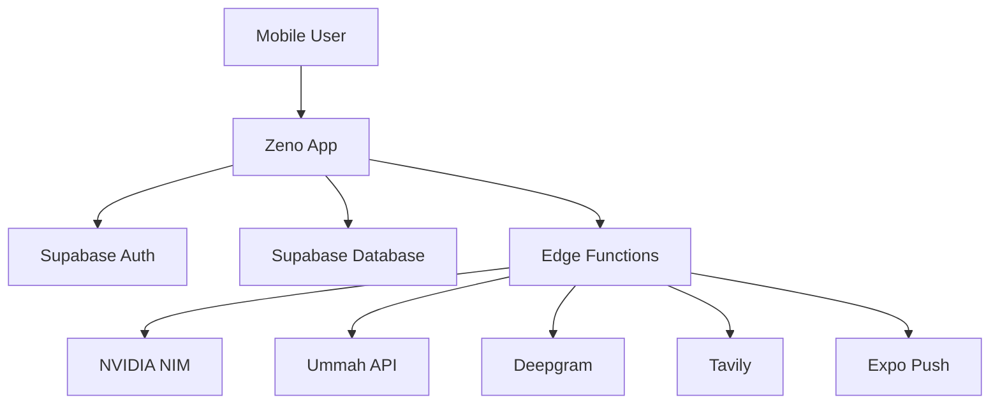
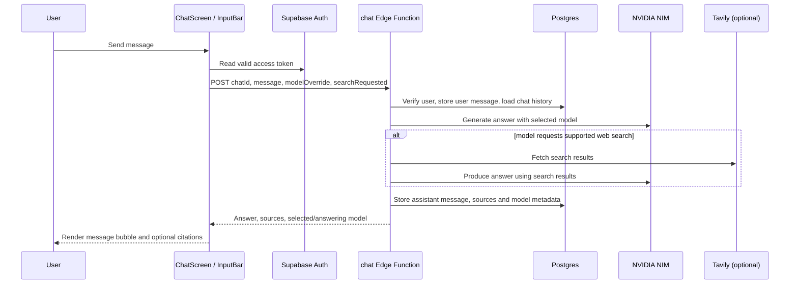
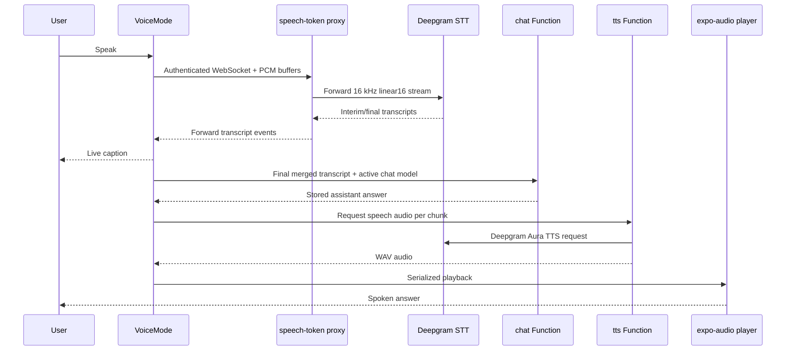

# Zeno App Architecture Guide

This document describes the application as implemented in this repository. It is intended for developers who need to understand the system before changing it.

## 1. Purpose

Zeno is an authenticated mobile chat application with general AI chat, optional web search, Quran and Hadith research, Hifz (memorisation) practice, Quran quizzes, daily Quran/Dua content, audio playback, notifications, and voice-to-voice chat.

The most important content rule is that Quran, Hadith, Dua, tafsir, and Quran audio are retrieved from approved sources. The app must not invent or alter religious source text.

## 2. High-level architecture



The mobile client never contains provider secrets. It authenticates as a Supabase user and calls Edge Functions, which validate that user before using server-side provider keys.

## 3. Technology stack

| Technology | Where it is used | Why it is used | Benefits | Trade-offs / disadvantages |
| --- | --- | --- | --- | --- |
| Expo SDK 57 + React Native 0.86 | Mobile client | One JavaScript/TypeScript codebase for Android, iOS, and web | Fast iteration, native controls, Expo services | Native edge cases and Expo Go limitations; custom native capabilities may require a development build |
| TypeScript | Client and Edge Functions | Safer contracts for screens, data, and API responses | Catches many errors before release | Does not validate runtime API data by itself |
| Expo Router | `app/` route tree | File-based mobile navigation | Clear route structure and native back behaviour | Route/state flows still need deliberate testing |
| Supabase Auth | Sign-in and session persistence | Managed user authentication | JWT sessions and client SDK integration | Depends on Supabase availability and correct RLS policies |
| Supabase Postgres + RLS | Chats, messages, progress, results, preferences, tokens | Managed relational storage with per-user isolation | SQL, migrations, row-level authorization | Schema changes require migrations and policy review |
| Supabase Edge Functions (Deno) | Server-side integration boundary | Hides keys and centralizes trusted provider calls | No provider secrets in the app; deployable serverless endpoints | Cold starts, provider latency, and function observability limits |
| NVIDIA NIM | General chat, sourced explanation, embeddings | Configurable hosted models | Model choice and tool support flexibility | Quality, latency, cost, and tool support vary by model |
| UmmahAPI | Quran, Hadith, Dua, tafsir, Quran audio | Verified retrieval source for Islamic content | Keeps source text separate from LLM generation | Availability and response shape are external dependencies |
| Deepgram | Voice recognition and TTS | Streaming speech-to-text and generated speech | Low-latency STT/TTS APIs | Accuracy depends on device, noise, language, endpointing, and provider behaviour |
| Tavily | Optional general web search | External current-web search for supported chat models | Adds fresh sources to general chat | Web results can be noisy; adds latency and a third-party dependency |
| pgvector | Quran semantic search | Similarity search over Quran translation embeddings | Better topic search than keywords alone | Embeddings are approximate and need precomputed indexed data |
| Expo Notifications | Daily Verse/Dua push | Cross-platform push integration | User-controlled delivery preferences | Remote push does not work in Expo Go on recent Expo SDKs |
| AsyncStorage | Session storage and small client preferences | Persistent local state | Simple offline persistence for appropriate small data | Not a replacement for secure server-side data or relational storage |
| `expo-audio` | Quran audio, TTS and microphone stream | Native audio playback and capture APIs | One audio API family across app surfaces | Audio lifecycle/routing requires careful serialization |
| Lucide React Native | Icons | Consistent scalable iconography | Lightweight reusable visual language | Adds no business capability; icon choices still need UX review |

## 4. Repository map

```text
app/
  _layout.tsx                 Root theme, fonts, auth boot, notification taps
  index.tsx                   Initial route redirect
  (auth)/sign-in.tsx          Authentication screen
  (chat)/                     Authenticated feature routes

components/
  ChatScreen, InputBar, MessageBubble, ModelPicker, Sidebar
  VoiceRecorder, VoiceMode
  QuranAyahText, QuranAudioPlayer

lib/
  supabase.ts, theme.tsx, models.ts, types.ts
  audio.ts, tts.ts, notifications.ts, surahs.ts

supabase/
  functions/                  Trusted server-side APIs
  migrations/                 Database schema and RLS changes

scripts/
  bulk_insert.js, embed_quran.py  Quran embedding/import support
```

## 5. Mobile application structure

### Root layout: `app/_layout.tsx`

The root layout:

1. loads Inter fonts;
2. restores the Supabase session and subscribes to auth changes;
3. provides the theme and safe-area context;
4. sets an opaque app background and matching status bar;
5. listens for a daily-notification tap and routes it to Today.

This centralization prevents each screen from independently managing app boot, safe areas, fonts, or notification deep links.

### Authenticated stack: `app/(chat)/_layout.tsx`

The authenticated layout checks for a session and redirects unauthenticated users to sign-in. It owns native Stack headers, consistent dark/light colors, back navigation, and fade transitions.

Routes are:

| Route | Screen | Main responsibility |
| --- | --- | --- |
| `/` | Chat home | Conversations, model selection, sidebar, Voice Mode |
| `/chat/[chatId]` | Chat route | Opens a selected conversation |
| `/quran` | Quran & Learning hub/workspace | Quran questions, lookup/search, Hadith search and learning entry points |
| `/hifz` | Hifz | Memorisation practice and progress |
| `/quiz` | Quran Quiz | Generated Quran question sessions and results |
| `/today` | Today | Daily Verse/Dua content |
| `/settings` | Settings | Appearance, notifications, history and app details |
| `/guide` | Help & Guide | How to use the app modes |

### Theme: `lib/theme.tsx`

`ThemeProvider` stores the mode, resolves light/dark colors, and provides typography and elevation helpers. Screens use `useColors()` rather than hard-coding independent palettes. The warm-neutral palette and amber accent therefore remain consistent.

## 6. General chat flow



### Client components

- `app/(chat)/index.tsx` loads chats/messages, creates chats, sends chat requests, manages selected model, sidebar state, and Voice Mode.
- `components/ChatScreen.tsx` renders the empty state or message list and coordinates scrolling.
- `components/InputBar.tsx` accepts text, enables optional web search, starts single-recording transcription, or opens Voice Mode.
- `components/MessageBubble.tsx` renders user/assistant messages, citations, copy controls, source labels, and normal message TTS.
- `components/Sidebar.tsx` manages recent chat selection, rename/delete, Quran hub navigation, Today navigation, and sign-out.
- `components/ModelPicker.tsx` exposes the curated NVIDIA NIM model list from `lib/models.ts`.

### `chat` Edge Function

The function validates the JWT, applies a per-user in-memory rate limit, reads the chat’s history, selects the requested model, saves the user message, and calls NVIDIA NIM. For a web-search request it uses tool-capable models, asks the model whether to search, fetches Tavily results when appropriate, then asks the model for the final sourced answer. It saves the assistant response, source metadata, and the model that actually answered.

Why model metadata is stored: a tool-capable fallback may answer a web search when the user-selected model cannot use tools. The UI can then display that fact honestly.

## 7. Quran and Islamic-content architecture

### Content-safety principle

The app treats source text and generated explanation differently:

- Quran Arabic, translations, Hadith, Dua, tafsir, word data, and Quran audio come from retrieval APIs.
- An LLM may summarize or explain retrieved material, but it is not used as the authority for the quoted source text.
- `components/QuranAyahText.tsx` preserves the raw Arabic supplied by the source and adds a presentational end-of-ayah marker only when the source text lacks one. It uses verified ayah metadata, Arabic-Indic digits, and avoids duplicate markers.

### Quran & Learning UI: `app/(chat)/quran.tsx`

The default `/quran` view is a hub. It provides entry points for:

- Ask Quran;
- Search Quran & Hadith;
- Continue Hifz;
- Quran Quiz;
- Today’s Verse & Dua.

The workspace has a compact Quran/Hadith switch. It calls different server functions depending on the request type while preserving existing result UI for Quran verses, translations, tafsir, word-by-word details, audio, source/citation material, and confidence states.

### Quran Edge Functions

| Function | What it does | Main services |
| --- | --- | --- |
| `quran-lookup` | Direct ayah lookup, Quran keyword search, word-by-word data, and tafsir lookup | UmmahAPI; one Arabic transliteration fallback source for direct lookup |
| `quran-answer` | Classifies Quran-related request paths, retrieves verses/Hadith/Duas/tafsir/semantic matches, and produces a constrained explanation | UmmahAPI, `quran-semantic-search`, NVIDIA NIM |
| `hadith-search` | Extracts keywords and searches verified Hadith collections | UmmahAPI |
| `quran-semantic-search` | Embeds a query and calls the vector-match SQL function | NVIDIA embeddings, pgvector/Postgres |
| `quran-embed` | Utility endpoint for Quran embedding generation | NVIDIA embeddings |
| `quran-audio` | Retrieves Quran recitation audio for a requested surah/ayah | UmmahAPI |
| `tadabbur` | Retrieves verse plus Ibn Kathir tafsir, then creates a bounded reflection | UmmahAPI, NVIDIA NIM |

### Semantic search

`quran_embeddings` stores one 1024-dimensional embedding and translation text per surah/ayah. `match_quran_verses` uses cosine distance to return the closest verses.

Benefits:

- finds conceptually related translations even when keywords differ;
- keeps matching in the app database after an embedding query is generated.

Limitations:

- similarity is not religious interpretation or proof;
- quality depends on the embedding model and indexed translation;
- it must be followed by source display and appropriate confidence handling.

### Hifz: `app/(chat)/hifz.tsx` and `memorization-progress`

The Hifz screen uses the local surah catalog for browsing and retrieves Quran content as needed. It supports reading, progressive hiding, and recall practice. Progress is stored per user, surah, and ayah.

`memorization-progress` supports `get`, `list-surah`, `list-all`, `update`, `update-range`, `review-due`, and `stats`. Review due dates use simple intervals of 1, 3, 7, and 14 days.

Benefits: progress is durable and isolated to the signed-in user. Limitation: the spaced-repetition schedule is intentionally simple rather than a full adaptive learning algorithm.

### Quran Quiz: `app/(chat)/quiz.tsx` and `quran-quiz`

The app requests a quiz for all surahs or a scoped surah, renders answer choices, records a score, and saves results. The function retrieves real verses from UmmahAPI and makes deterministic question types such as completing a verse, identifying a surah, or matching a translation; it does not ask an LLM to invent questions or Quran text.

### Today: `app/(chat)/today.tsx` and `send-daily-notification`

Today loads shared daily content. The daily notification function derives a deterministic daily verse key and Dua ID from the day of year, retrieves them from UmmahAPI, selects users with enabled preferences and push tokens, then sends an Expo push payload.

This means all users can receive the same daily item while each user independently controls whether and when notifications are enabled.

## 8. Voice and audio architecture



### Voice Mode: `components/VoiceMode.tsx`

Voice Mode streams microphone audio with `expo-audio` in 16 kHz, mono, signed 16-bit PCM. It:

1. requests microphone permission;
2. opens an authenticated WebSocket to `speech-token`;
3. sends buffers once the connection is ready;
4. receives Deepgram interim/final transcript events;
5. merges final and interim text for live captions without repeating overlap;
6. submits on Deepgram endpoint-final, explicit confirmation, or a silence fallback;
7. calls the normal `chat` function with the active chat’s `modelOverride`;
8. pauses microphone streaming during TTS;
9. plays answer chunks sequentially;
10. returns to listening when speech completes.

The selected chat model is preserved for voice requests. Voice Mode does not inherently guarantee GPT-level answers; the quality depends on the currently selected configured model and provider response.

### Speech proxy: `speech-token`

Despite its historical name, this function is a WebSocket proxy rather than a token issuer. It validates the Supabase JWT, opens a server-side Deepgram WebSocket using the secret Deepgram key, queues early client buffers until Deepgram opens, and forwards Deepgram messages back to the device. This prevents the Deepgram key from reaching the mobile client.

### Text-to-speech: `tts` and `lib/tts.ts`

The `tts` Edge Function validates the caller and asks Deepgram Aura (`aura-orion-en`) for WAV audio.

`lib/tts.ts` is the shared playback manager. It owns one audio player and records the owner, session, and chunk for the active playback. It attaches a completion observer before playback, uses a guarded duration-based fallback if platform completion is missing, resolves each playback once, and prevents stale Voice Mode sessions from changing current state. Normal message playback and Voice Mode use ownership/session information to avoid accidental competition.

`lib/audio.ts` is separate: it manages Quran recitation audio state and player lifecycle.

## 9. Notifications

`lib/notifications.ts` safely loads Expo Notifications only outside Expo Go, because remote push APIs are unavailable in Expo Go in recent SDKs. It registers the device, stores push tokens and preferences in Supabase, and handles notification taps.

Settings manages Daily Verse, Daily Dua, and preferred time. The server-side notification function uses stored preferences and tokens to deliver push payloads.

## 10. Database and authorization

The app also uses existing chat tables (`chats` and `messages`) through Supabase. The migrations in this repository add:

| Table | Purpose | Important ownership rule |
| --- | --- | --- |
| `memorization_progress` | Hifz status per ayah | `user_id` must equal `auth.uid()` |
| `quiz_results` | Score history | `user_id` must equal `auth.uid()` |
| `push_tokens` | Device Expo push tokens | Users may access only their tokens |
| `notification_preferences` | Daily notification controls | Users may access only their preferences |
| `quran_embeddings` | Indexed translation vectors | Shared content/search index, not user progress |

Row Level Security is enabled on user-owned tables and policies constrain reads/writes to the authenticated owner. Edge Functions additionally validate the bearer token before using service-role access.

Benefits: authorization is enforced at the database level as well as in application code. Risk: a new table/function must be reviewed for both its code-level user checks and RLS policy, or isolation can be weakened.

## 11. External configuration and secrets

Client-safe Expo public configuration includes:

- `EXPO_PUBLIC_SUPABASE_URL`
- `EXPO_PUBLIC_SUPABASE_ANON_KEY`
- optionally `EXPO_PUBLIC_EXPO_PROJECT_ID`

Server-only function secrets include:

- `SUPABASE_URL`
- `SUPABASE_SERVICE_ROLE_KEY`
- `NVIDIA_NIM_API_KEY`
- `UMMAH_API_KEY`
- `DEEPGRAM_API_KEY`
- the Tavily API key used by the chat function

Never commit production secrets or put server-only keys in an `EXPO_PUBLIC_*` value. Public Expo environment values are bundled into the app.

## 12. Reliability and operational considerations

### Strengths

- Authentication and RLS protect private user data.
- Server functions keep AI/content-provider keys out of the client.
- Quran source text uses retrieval rather than model invention.
- Voice uses streaming STT and serialized TTS lifecycle management.
- Feature modules are separated by responsibility.

### Main risks

- Every major feature depends on third-party network services.
- Serverless functions can add latency or cold starts.
- Model quality varies substantially across the selectable catalog.
- Deepgram STT quality varies with microphone, room noise, accent, language, and speaker echo.
- In-memory rate limiting in a serverless runtime is best-effort, not a durable distributed limiter.
- Quran semantic search assists discovery but cannot replace verified source review.
- Expo Go cannot test all remote-notification behaviour.

### Recommended verification before releases

1. Run `./node_modules/.bin/tsc.cmd --noEmit` on Windows.
2. Run `git diff --check`.
3. Test auth restore, sign-out, chat creation, message persistence, model switching, and web-search fallback.
4. Test Quran lookup (`2:255`), Quran question, Hadith search, tafsir, word-by-word display, audio, and ayah markers.
5. Test Hifz progress, Quiz result saving, Today content, and notification preferences.
6. Test Voice Mode with captions, a short silence, explicit confirm/cancel, TTS completion, End Call, and normal message TTS.
7. Test Android hardware back and deep links for `/quran`, `/hifz`, `/quiz`, `/today`, `/settings`, and `/guide`.

## 13. Change guidelines

- Keep source Quran Arabic immutable; presentation-only formatting belongs in `QuranAyahText`.
- Do not replace retrieved religious text with generated text.
- Put provider calls behind authenticated Edge Functions.
- Preserve route and Stack ownership of headers/safe areas.
- Treat voice, audio, and notifications as lifecycle-sensitive: test on a real device after changes.
- Add a migration and RLS policy whenever persistent user data is introduced.
- Prefer a focused feature phase over broad simultaneous refactors.
